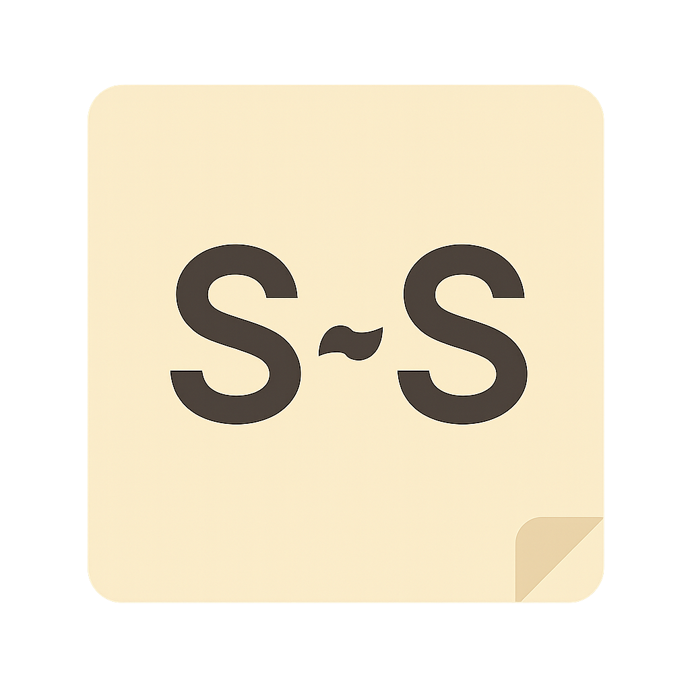
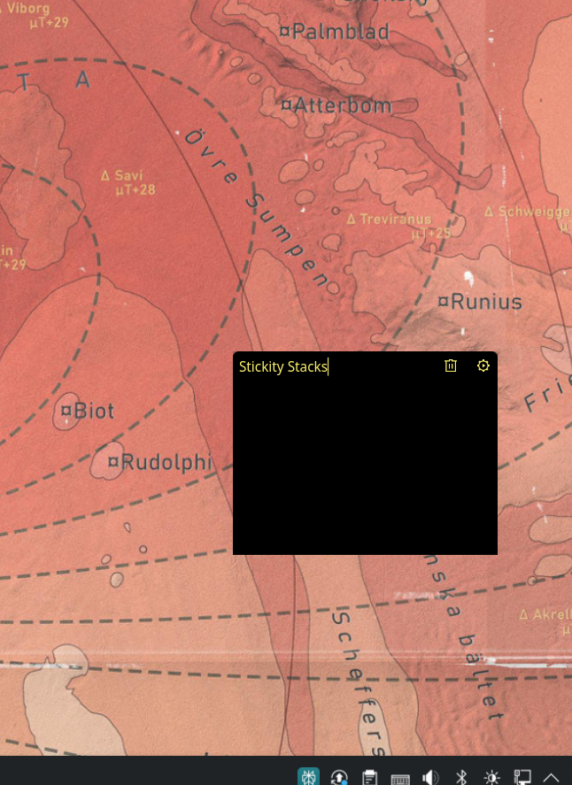
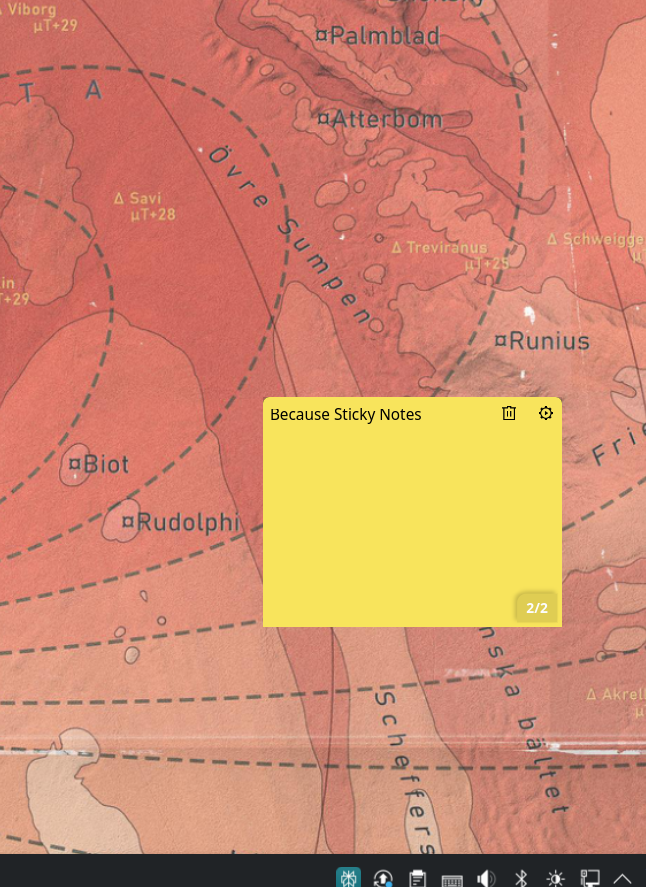
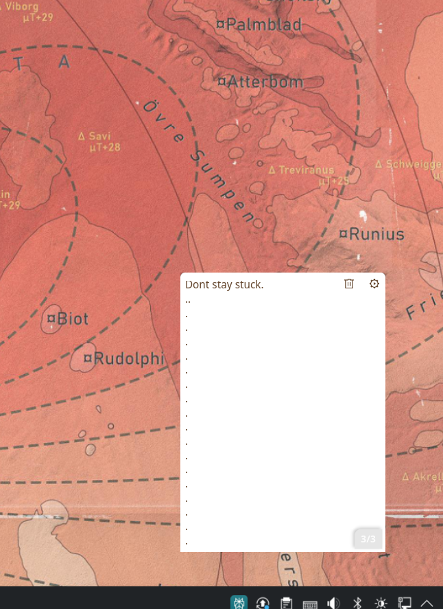
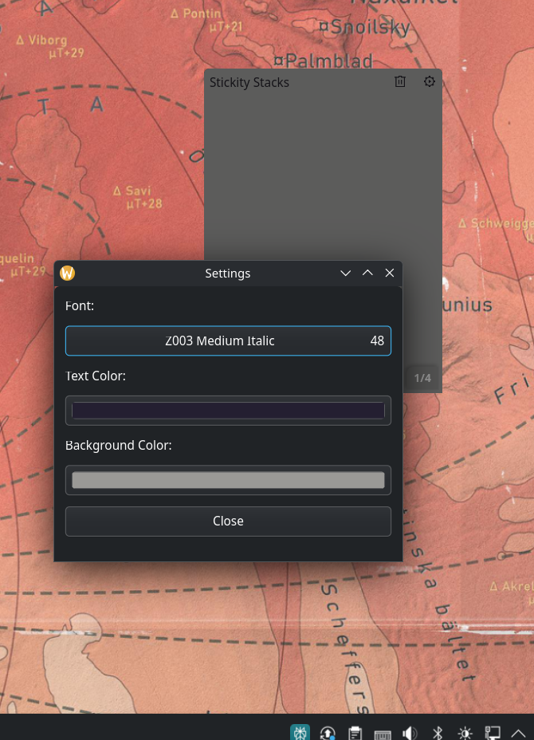

# Stickity Stacks


A frameless, lightweight GTK4 sticky note application written in Python. Create, stack, and customize multiple sticky notes with persistent storage and seamless desktop integration.

<div align="center">
  
</div>

## 📸 Screenshots

<table>
  <tr>
    <td align="center">
      <br>
      <em>Clean, frameless sticky note</em>
    </td>
    <td align="center">
      <br>
      <em>Multiple notes with dog-ear indicator</em>
    </td>
  </tr>
  <tr>
    <td align="center">
      <br>
      <em>Different colors and content</em>
    </td>
    <td align="center">
      <br>
      <em>Font and color customization</em>
    </td>
  </tr>
</table>

## ✨ Features

- **Frameless Design**: Clean, borderless sticky notes that blend seamlessly with your desktop
- **Note Stacking**: Create and manage multiple notes with `Ctrl+S`
- **Visual Navigation**: Dog-ear indicator shows current note position in stack (e.g., "2/4")
- **Quick Actions**: Delete notes with `Ctrl+D` or the trash icon
- **Full Customization**: Personalize fonts, text colors, and background colors
- **Drag to Move**: Click and drag anywhere on the note to reposition
- **Persistent Storage**: All notes and styling preferences are automatically saved
- **Desktop Integration**: Add to your application menu and launcher
- **Linux Ready**: Optimized for GTK4-compatible Linux distributions

## 📋 Prerequisites

Before installing Stickity Stacks, ensure you have the following dependencies:

- Python 3.6 or higher
- GTK4 development libraries
- Python GObject introspection bindings

### Installing Dependencies

**Fedora/RHEL/CentOS:**
```bash
sudo dnf install python3-gobject gtk4
```

**Ubuntu/Debian:**
```bash
sudo apt install python3-gi gir1.2-gtk-4.0
```

**Arch Linux:**
```bash
sudo pacman -S python-gobject gtk4
```

## 🚀 Installation

1. **Clone the repository:**
   ```bash
   git clone https://github.com/Hot-snakes/stickity-stacks.git
   cd stickity-stacks
   ```

2. **Make the script executable (optional):**
   ```bash
   chmod +x stickity_stacks.py
   ```

## 🎯 Usage

### Running the Application

**Method 1: Using Python**
```bash
python3 stickity_stacks.py
```

**Method 2: Direct execution** (if made executable)
```bash
./stickity_stacks.py
```

### Keyboard Shortcuts

| Shortcut | Action |
|----------|--------|
| `Ctrl+S` | Create new note (stack) |
| `Ctrl+D` | Delete current note |

### Mouse Controls

- **Move note**: Click and drag anywhere on the note
- **Switch notes**: Click the dog-ear corner indicator (shows current position like "2/4")
- **Settings**: Click the gear icon (⚙️) to customize fonts and colors
- **Delete**: Click the trash icon (🗑️) to delete current note

## 🖥️ Desktop Integration

Add Stickity Stacks to your application menu for easy access:

1. **Copy the desktop file:**
   ```bash
   cp com.stickity.stacks.desktop ~/.local/share/applications/
   ```

2. **Install the application icon:**
   ```bash
   # Create icons directory if it doesn't exist
   mkdir -p ~/.local/share/icons
   
   # Copy the icon
   cp stickity-stacks.png ~/.local/share/icons/
   ```

3. **Update the desktop file path (if needed):**
   
   Edit `~/.local/share/applications/com.stickity.stacks.desktop` and ensure the `Exec=` line points to your script:
   ```desktop
   Exec=/full/path/to/stickity_stacks.py
   ```

4. **Refresh the application database:**
   ```bash
   update-desktop-database ~/.local/share/applications
   ```

After installation, Stickity Stacks will appear in your application grid and can be launched like any other desktop app.

## 🎨 Customization

Stickity Stacks offers extensive customization options:

- **Fonts**: Choose from any system font with size adjustment
- **Text Color**: Pick any color for your note text
- **Background Color**: Customize note background colors
- **Persistent Settings**: All preferences are saved automatically

Access customization through the gear icon (⚙️) in the top-right corner of any note.

## 📁 Project Structure

```
stickity-stacks/
├── stickity_stacks.py              # Main application
├── com.stickity.stacks.desktop     # Desktop integration file
├── stickity-stacks.png             # Application icon
├── stickity_stacks_notes.json      # Auto-generated notes storage
├── snapcraft.yaml                  # Snap package configuration
├── .gitignore                      # Git ignore rules
├── README.md                       # This file
└── LICENSE                         # MIT License
```

## 🔧 Development

### Contributing

We welcome contributions! Here's how you can help:

1. **Fork the repository**
2. **Create a feature branch**: `git checkout -b feature/amazing-feature`
3. **Commit your changes**: `git commit -m 'Add some amazing feature'`
4. **Push to the branch**: `git push origin feature/amazing-feature`
5. **Open a Pull Request**

### Issues and Bug Reports

Found a bug or have a feature request? Please [open an issue](https://github.com/Hot-snakes/stickity-stacks/issues) on GitHub.

### Development Setup

```bash
# Clone the repository
git clone https://github.com/Hot-snakes/stickity-stacks.git
cd stickity-stacks

# Install dependencies (Fedora example)
sudo dnf install python3-gobject gtk4

# Run the application
python3 stickity_stacks.py
```

## 📦 Packaging

### Snap Package

A `snapcraft.yaml` file is included for creating Snap packages:

```bash
snapcraft
```

## 🔒 Data Storage

- Notes and preferences are stored in `stickity_stacks_notes.json`
- This file is automatically created and updated
- The file is excluded from git tracking to protect user privacy
- Safe to delete if you want to reset all notes and settings

## 📝 License

This project is licensed under the MIT License - see the [LICENSE](LICENSE) file for details.

## 👨‍💻 Author

**Tyrrell Chartrand**
- GitHub: [@Hot-snakes](https://github.com/Hot-snakes)
- Email: mr0tstihs81@gmail.com

## 🙏 Acknowledgments

- Built with [GTK4](https://gtk.org/) and [Python](https://python.org/)
- Inspired by the need for simple, effective desktop note-taking
- Thanks to the GTK and Python communities for excellent documentation

## 🚀 Future Features

- [ ] Multiple note windows
- [ ] Note export functionality
- [ ] Reminder/alarm integration
- [ ] Cloud sync capabilities
- [ ] Plugin system for extensions

---

<div align="center">
  <strong>Happy note stacking! 📝✨</strong>
</div>
